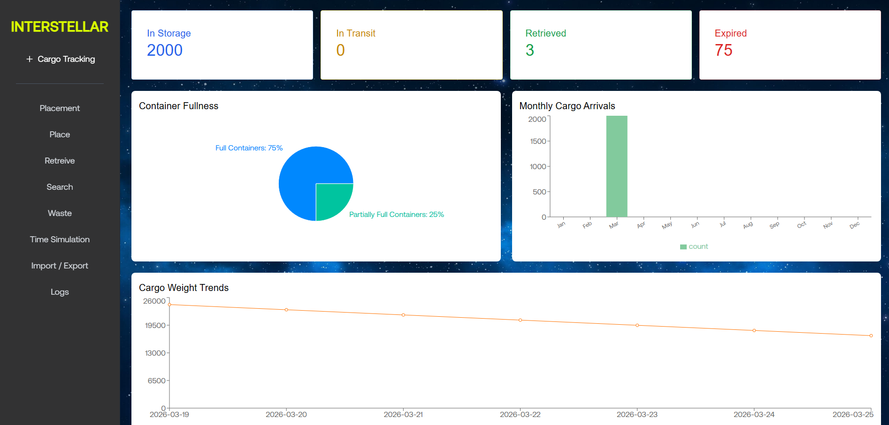
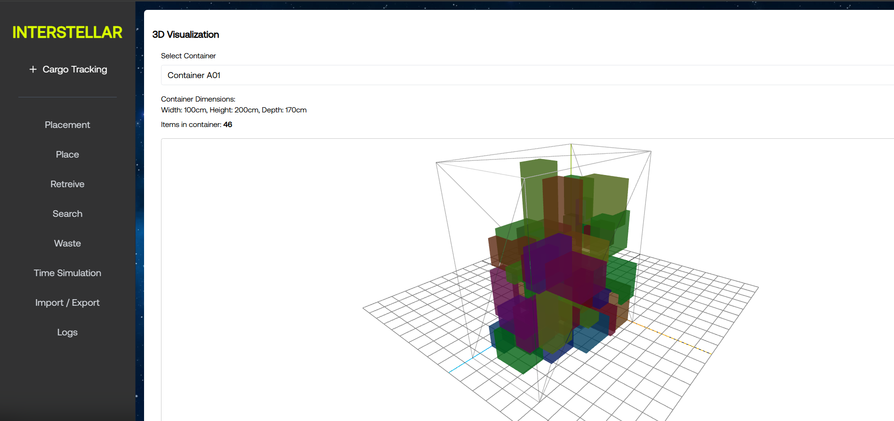
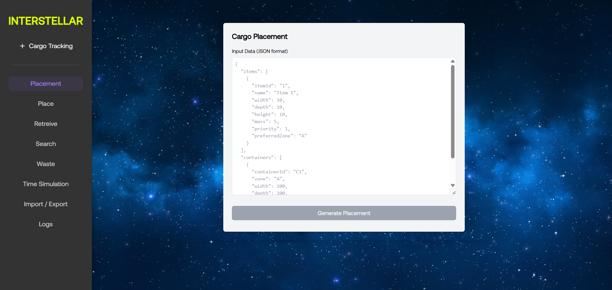
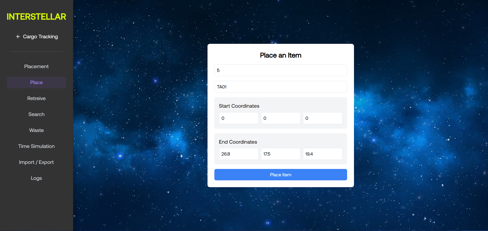
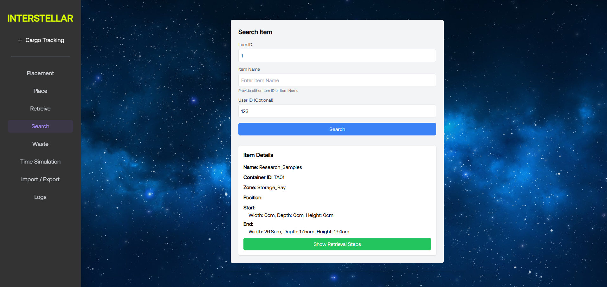
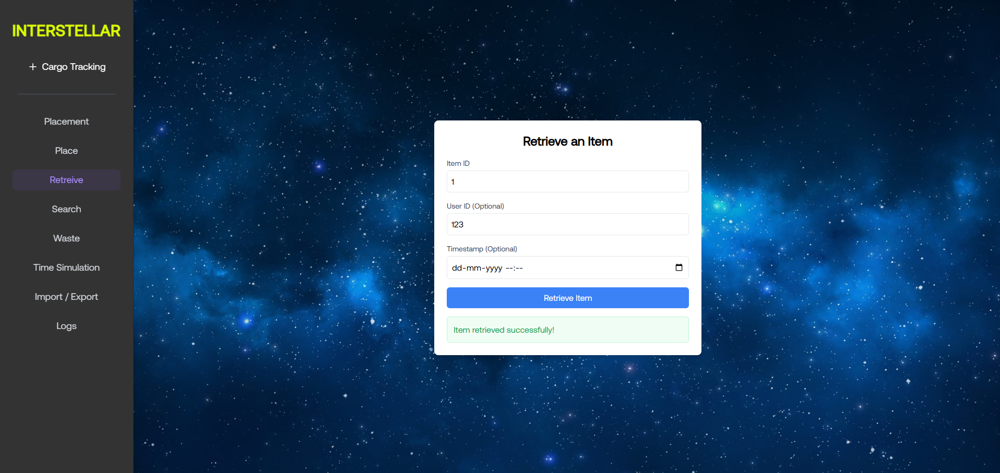
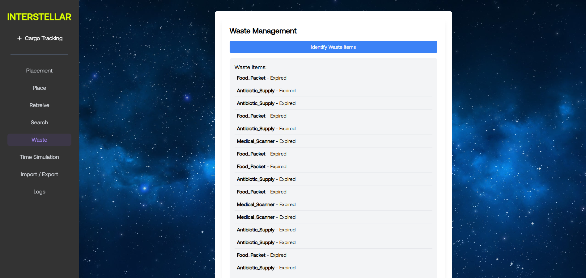
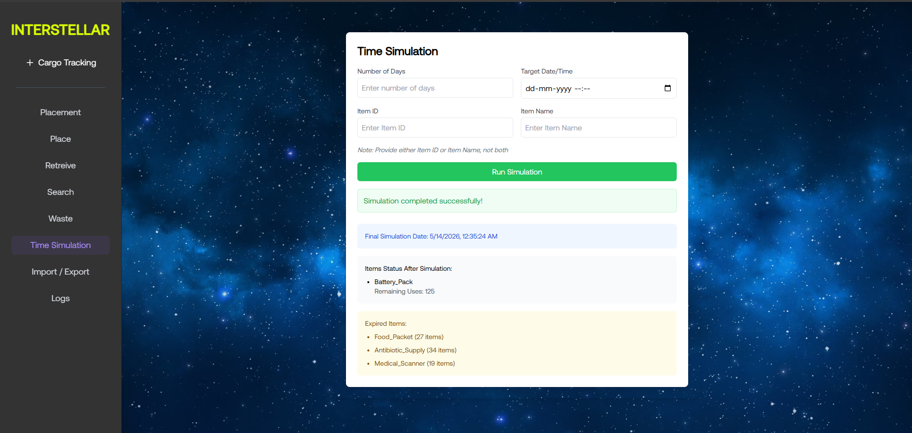
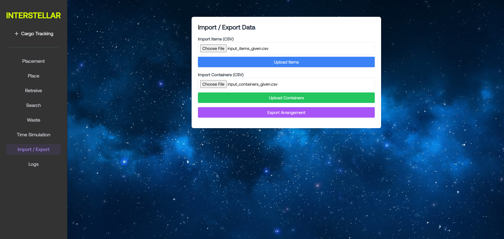
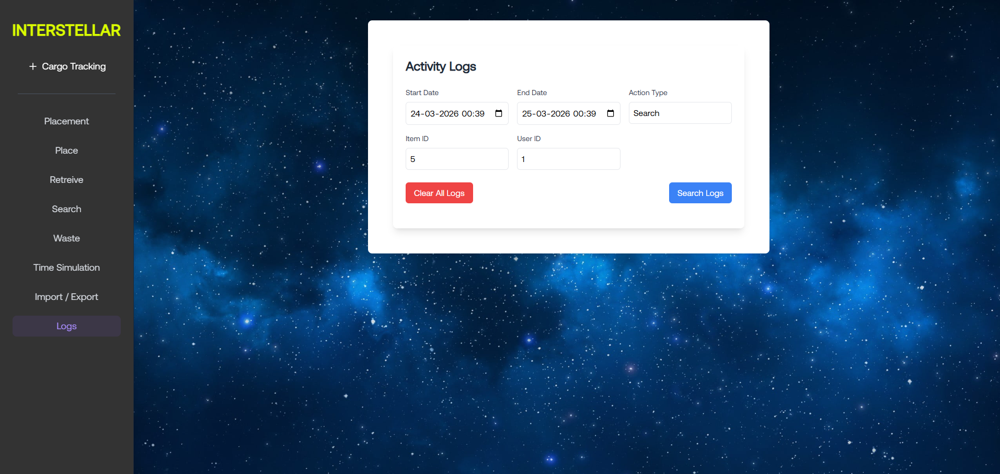

# Interstellar Cargo Management System

## Overview

The Interstellar Cargo Management System is an intelligent software solution designed to optimize cargo storage, retrieval, and lifecycle management inside constrained environments such as space stations. In real-world scenarios like the International Space Station (ISS), astronauts spend a significant portion of their time managing cargo manually. This system automates that process using algorithmic optimization, efficient data structures, and a responsive user interface.

The system acts as a stowage advisor that ensures efficient utilization of limited space, minimizes retrieval effort, and handles waste management and mission planning.

---

## Problem Statement

Cargo management in space involves handling thousands of items with varying priorities, dimensions, expiry constraints, and usage limits. These items must be placed inside containers with strict spatial constraints while ensuring:

* High-priority items are easily accessible
* Retrieval requires minimal obstruction handling
* Space is utilized efficiently without fragmentation
* Expired or depleted items are handled as waste
* Rearrangement is minimized to save astronaut time

The challenge lies in solving a **multi-objective optimization problem** involving:

* 3D spatial packing
* Pathfinding for retrieval
* Dependency resolution between items
* Time-based state changes
* Resource-constrained waste return planning

This system solves these challenges using optimized algorithms and structured APIs.

---

## Core Features

### 1. Landing Interface

The landing page provides the entry point into the system and allows navigation across all modules of the application.


---

### 2. Dashboard

The dashboard acts as the central control panel, summarizing system state and providing access to all functionalities including cargo tracking and operations.



---

### 3. Cargo Tracking (3D Visualization)

A 3D visualization module represents containers and item placements spatially. This helps users understand how cargo is arranged and improves interaction with placement and retrieval logic.



---

### 4. Smart Placement (Algorithmic Optimization)

The placement system uses a combination of spatial partitioning and heuristic optimization:

* A **Sparse Matrix** is used to efficiently track occupied regions in 3D space
* A **grid-based search** is used to find valid placement positions
* Items are sorted by **priority and volume** before placement
* Supports **90-degree rotations** to maximize fit
* Uses **rearrangement cost calculation** to decide minimal movement strategy

If no direct placement is possible, the system:

* Identifies low-priority items
* Moves them temporarily
* Minimizes total rearrangement cost

This ensures optimal space utilization while preserving accessibility.



---

### 5. Place Operation

After retrieval, items can be placed back into containers. The system updates spatial structures and ensures no overlap occurs using efficient occupancy checks.



---

### 6. Search System (Dependency-Based Retrieval Planning)

The search module identifies items using ID or name and computes optimal retrieval steps using a **dependency graph approach**:

* Detects blocking items based on:

  * Depth (front vs behind)
  * Width overlap
  * Priority comparison
* Constructs a sequence:

  * Remove blocking items
  * Retrieve target item
  * Place items back

This ensures logical and minimal-step retrieval.



---

### 7. Retrieval Optimization (A* Pathfinding)

The retrieval system uses a **Priority-based A* search algorithm**:

* Uses **Manhattan distance heuristic**
* Incorporates:

  * Item priority
  * Expiry urgency
  * Usage limits
* Uses a **priority queue (heap)** for efficient path exploration
* Avoids occupied cells dynamically
* Computes:

  * Total cost
  * Safety score (based on vertical movement)
  * Priority score

This ensures the fastest and safest retrieval path.



---

### 8. Waste Management and Return Planning

The waste system identifies expired or depleted items and processes them using:

* CSV-based data integration
* Linking with original item properties
* **Greedy selection algorithm** for return planning:

  * Prioritizes heavier items within weight constraints
* Generates:

  * Return plan
  * Retrieval steps
  * Manifest including volume and weight

This ensures efficient undocking and space reclamation.



---

### 9. Time Simulation

The system simulates time progression to model real mission conditions:

* Items lose usage count on retrieval
* Expiry dates are evaluated dynamically
* Items automatically transition to waste
* Supports:

  * Single day simulation
  * Multi-day fast-forward

This enables predictive planning.



---

### 10. Import and Export System

The system supports CSV-based data operations:

* Import items and containers
* Validate input structure
* Export cargo arrangement with coordinates

This ensures interoperability and testing scalability.



---

### 11. Logging System

All system actions are recorded for traceability:

* Placement
* Retrieval
* Rearrangement
* Waste disposal

Logs include timestamps, user actions, and container transitions.



---

## Project Structure

```
space_cargo_management/
├── algos/                # Core algorithms (placement, retrieval, search, waste)
├── routers/              # API endpoints
├── src/                  # React frontend
├── public/               # Static assets
├── screenshots/          # UI images
├── main.py               # Backend entry point
├── requirements.txt      # Python dependencies
├── package.json          # Frontend dependencies
├── Dockerfile            # Deployment configuration
```

---

## Tech Stack

Backend:

* FastAPI
* Python
* NumPy
* Polars

Frontend:

* React.js
* Tailwind CSS

Deployment:

* Docker (Ubuntu 22.04)

---

## API Endpoints

Placement:
POST /api/placement

Search:
GET /api/search

Retrieve:
POST /api/retrieve

Place Item:
POST /api/place

Waste Management:
GET /api/waste/identify
POST /api/waste/return-plan

Simulation:
POST /api/simulate/day

Import/Export:
POST /api/import/items
POST /api/import/containers
GET /api/export/arrangement

Logs:
GET /api/logs

---

## Algorithms Used

* Spatial partitioning using Sparse Matrix 
* Priority-based placement with rearrangement cost optimization 
* A* pathfinding with priority heuristics 
* Dependency graph for retrieval steps 
* Greedy selection for waste return planning 

---

## Getting Started

### Backend

```
pip install -r requirements.txt
uvicorn main:app --reload
```

---

### Frontend

```
npm install
npm start
```

---

### Docker

```
docker build -t cargo-app .
docker run -p 8000:8000 cargo-app
```

---

## Author

Ajay Anand
